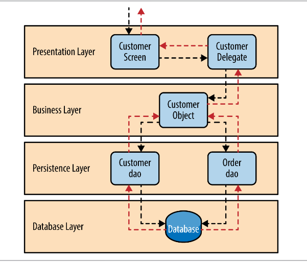

#Layering Pattern
Es gibt mehrere Stufen der "Einhaltung": wird das Schichtenmodell stark eingehalten, kann ein Layer nur mit der darüber liegenden und darunter liegenden Schichten kommunizieren. Lose gekoppelt kann eine höhere liegende Schicht mit mehreren darunter liegenden kommunizieren. 

##Intent
Bei Anpassungen an Klassen ist nur die jeweilige Schicht (Layer) und die anliegenden Schichten betroffen im Gegensatz zur ganzen Applikation.

##Applicability
* Grössere Software-Projekte
* Wenn mehrere Programmier-Teams zusammen arbeiten
* Load-Balanced applications 
* Multi-Server-Anwendungen

##Consequences
###Pro
* Layer können ausgetauscht werden.
* Testbarkeit (Layer können einzeln getestet werden)
* Layer können verteilt werden (Server, Anwendungen)
* Layer können einzeln angepasst und aktualisiert werden
* Security durch einzelne Layer höher 

###Contra
* Schlechtere Performance, da Abfragen alle Layer passieren.
  * Performance kann auch verbessert werden indem Layer übersprungen werden.
* Unter Umständen unnötig höhere Komplexität durch ähnliche Klassen über mehrere Layer (z. B. Security)
* Fehlerquellen erhöhen sich mit zunahme an Komponenten.
* Je nach Einsatzgebiet werden mehr Klassen benötigt als bei anderen Patterns.

##Diagramm

