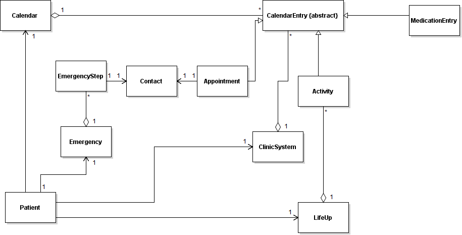
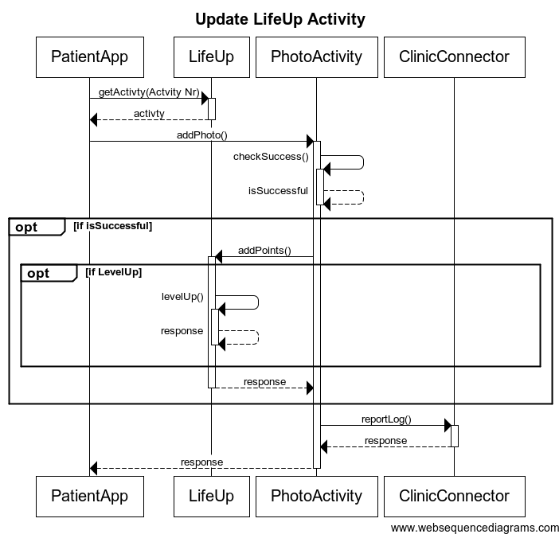
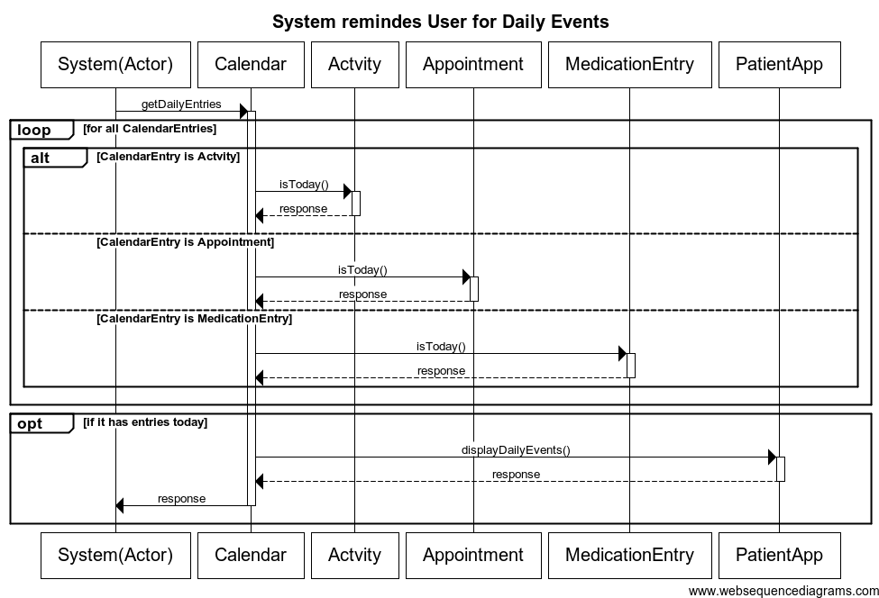
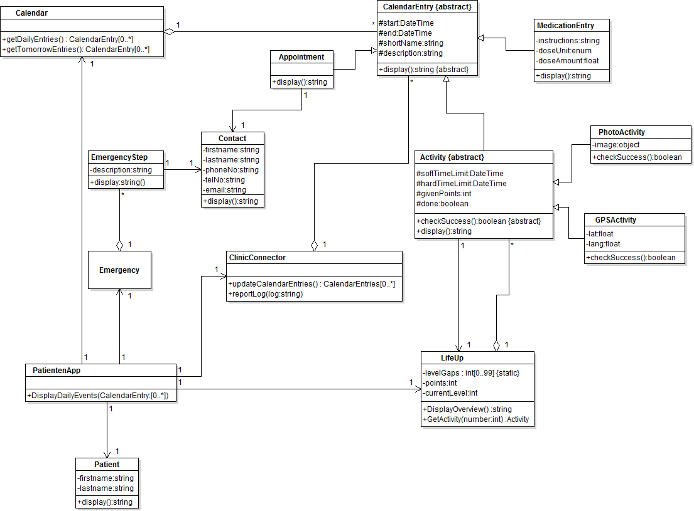

#Desgin

##Domain Model Diagramm

##Sequenzdiagramme 

* Der User erfüllt eine Aufgabe (Actitvity) im Spiel Life up.

Das System erinnert den User an alle, für diesen Tag, anstehenden Events (=Dinge, die der Patient zu erledigen hat)
z.B. 
* im LifeUp "einkaufen gehen"
* Medikamente einnehmen
* Termin beim Arzt wahrnehmen

##Class Diagramm

